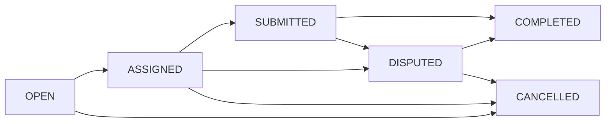

# MicroJobMarket Smart Contract

A decentralized marketplace for micro-jobs implemented in Clarity for the Stacks blockchain.

## Overview

MicroJobMarket enables users to create and complete micro-jobs with secure payment handling through smart contract escrow. The contract manages the entire workflow from job creation to payment resolution, including dispute handling.

## Features

- 🔒 **Secure Escrow System**: STX tokens are locked in the contract until work completion
- 👥 **Role-Based Actions**: Distinct flows for job posters and workers
- ⚖️ **Dispute Resolution**: Built-in mechanism for handling disagreements
- 📊 **Status Tracking**: Complete job lifecycle management
- 🔍 **Transparent**: All actions are recorded on-chain

## Contract Functions

### For Job Posters

```clarity
(create-job (price uint) (title (string-ascii 64)) (description (string-ascii 256)))
(approve-work (id uint))
(cancel-job (id uint))
```

### For Workers

```clarity
(accept-job (id uint))
(submit-work (id uint) (work-hash (string-ascii 256)))
```

### Dispute Handling

```clarity
(raise-dispute (id uint) (reason (string-ascii 256)))
(resolve-dispute (id uint) (pay-worker bool))
```

### Read-Only Functions

```clarity
(get-job (id uint))
(view-escrow (id uint))
(job-summary (id uint))
(get-job-count)
```

## Job Status Flow



## Getting Started

1. **Prerequisites**
   - Clarinet
   - Stacks Wallet
   - Node.js

2. **Installation**
   ```bash
   git clone https://github.com/yourusername/microjobmarket
   cd microjobmarket
   clarinet test
   ```

3. **Deployment**
   ```bash
   clarinet deploy --network testnet
   ```

## Security Features

- Escrow mechanism ensures fair payment
- Status validation prevents invalid state transitions
- Admin-controlled dispute resolution
- Principal-based access control

## Testing

Run the test suite:
```bash
clarinet test tests/microjobmarket_test.clar
```

## Contributing

1. Fork the repository
2. Create your feature branch
3. Commit your changes
4. Push to the branch
5. Open a Pull Request

## License

This project is licensed under the MIT License - see the LICENSE file for details.

## Contact

For questions and support, please open an issue in the GitHub repository.

---
**Note**: This contract is a prototype and should be thoroughly audited before production use.
